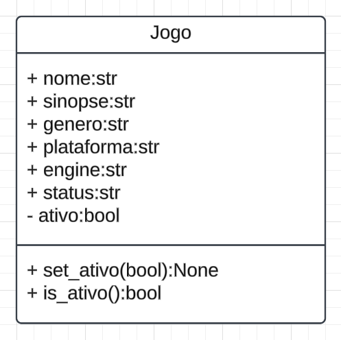

# NExT | **Programação Orientada a Objetos** com Python


## Aula 02 - Classes e Objetos

### Na aula de hoje

- Classes
- Objetos
- Atributos de Instância
- Método `__init__()`

------------------

## ⚙️ Programação Orientada a Objetos

**Programação Orientada a Objetos** é um dos paradigmas de programação mais populares, que serve como base para vários outros. Neste paradigma, cada entidade do problema/contexto é modelado como um objeto, que pode se relacionar com outros.

### Classes e Objetos

- **Classe**: é um modelo ou "molde" que define as características (atributos) e comportamentos (métodos) de um conjunto de objetos similares.
- **Objeto**: é uma instância concreta de uma classe. Quando criamos um objeto, estamos construindo algo a partir do "molde" fornecido pela classe.

Por exemplo, se temos uma classe `Carro`, cada objeto `carro_popular`, `carro_viagem` etc. será um carro específico, com suas propriedades (como cor, modelo, ano) e seus métodos (como acelerar, frear).

## Criação de Classes e Objetos em Python

Em Python, a sintaxe básica para criar uma classe é:

```python
class NomeDaClasse:
    # Aqui vão os atributos (variáveis) e métodos (funções) da classe
    pass
```

- **Palavra-chave `class`**: usada para iniciar a definição de uma classe.
- **NomeDaClasse**: por convenção, iniciamos com letra maiúscula e, se houver mais de uma palavra, utilizamos o CamelCase (ex: `Carro`, `MeuCarro`, `CalculadoraSimples`).

Inicialmente, podemos criar uma classe vazia, apenas com a palavra `pass` ou `...` para indicar que não há nada definido ainda.

Exemplo:

```python
class Carro:
    pass
```

Aqui, criamos uma classe `Carro`, ainda sem atributos ou métodos.

## Atributos de uma Classe

Podemos definir uma série de atributos para uma classe. Cada atributo serve como uma espécie de variável que vai armazenar um valor.

```python
class Carro:
    n_rodas = 4
    modelo = 'sedan'
    motor = 2.0
```

### Objeto: Instâncias de uma Classe

Podemos entender uma classe que criamos como um novo tipo de dado. Desta forma, podemos criar variáveis usando este tipo de dado, **instanciando um novo objeto**.

```python
prisma = Carro()

print(prisma.n_rodas)
print(prisma.modelo)
print(prisma.motor)
```

## Atributos de Instância

Quando definimos um atributo para uma classe, o seu valor é o mesmo para todas as instâncias (objetos).

**Atributos de Instância** são variáveis que pertencem a cada objeto criado a partir da classe. Cada objeto pode ter valores diferentes para esses atributos.

Para criar atributos e métodos, vamos começar pelo método especial `__init__()`, que é o inicializador/construtor do objeto.

### Método `__init__()`

O método `__init__()` é chamado automaticamente quando criamos uma nova instância (objeto) da classe. Ele serve para inicializar os atributos do objeto.

```python
class Carro:
    n_rodas = 4

    def __init__(self, modelo, motor):
        # Agora se torna obrigatório informar
        # o modelo e motor do carro
        self.modelo = modelo
        self.motor = motor

prisma = Carro('sedan', 1.2)
gol = Carro('hatch', 1.0)
fox = Carro('hatch', 1.0)

print(prisma.modelo)
print(gol.modelo)
print(fox.modelo)
```

> 💡 `self`: é uma referência ao próprio objeto. Sempre que criamos um método dentro da classe, o primeiro parâmetro deve ser `self` para que o método possa acessar os atributos e outros métodos da mesma instância.

## Regras de Negócio

Se por um lado um número inteiro pode ser negativo, quando esse número representar a idade de uma pessoa, não faz sentido com que esse valor seja menor que zero.

Esse tipo de restrição é chamada de **"Regra de Negócio"**, ou seja, regras que são específicas do contexto da solução.

Quando precisamos controlar a forma como um atributo é manipulado, podemos criar métodos `get` e `set` para implementar as regras de acesso ou manipulação do atributo.

- `get_atributo`: usado para retornar o valor do atributo;
- `set_atributo`: usado para definir um valor para o atributo;

_ℹ️ Vamos falar mais sobre isso amanhã._

```python
class Pessoa():
    def __init__(self, nome):
        self.nome = nome
        self.idade = 0

    def set_idade(self, idade):
        if idade >= 0:
            self.idade = idade

    def get_idade(self):
        return self.idade
```

O que está acontecendo aqui?

- No método `__init__`, definimos que toda pessoa terá `nome`.
- A idade é um atributo que tem o seu valor sendo definido automaticamente como `zero`.
- O método `set_idade` recebe como parâmetro a idade e verifica se o valor é válido.
- O método `get_idade` retorna o valor da idade.

### Testando a classe

```python
p = Pessoa('Predo')

print(p.nome)

p.set_idade(-20)
print(p.get_idade())

p.set_idade(41)
print(p.get_idade())
```

Neste caso, a primeira tentativa de definir um valor para idade não tem efeito, visto que o valor é inválido. Já segunda tentativa em efeito.

## 🔥🔨 FORJA Contato

Vamos começar criando a classe Jogo. Esta classe deve ter o atributo `ativo` privado e dois métodos. Um para alterar o valor e outro para checar que o jogo é um projeto ativo ou não.



Nos próximos encontros vamos dar sequência ao desenvolvimento deste projeto.

## 🧱 Exercícios Fundamentais

### 1. **Livro**

Crie uma classe `Livro` com atributos `titulo` e `autor` e um método `exibir_informacoes()` que imprime o título e o autor.

- Crie três objetos dessa classe, cada um representando um livro diferente, e chame o método `exibir_informacoes()` para cada um.

### 2. **Conta Bancária**

Crie uma classe `ContaBancaria` que tenha os atributos `titular` (_str_), `saldo` (_float_) e os métodos `depositar(valor)`, `sacar(valor)` e `exibir_saldo()`.

- O método `depositar` deve aumentar o saldo pelo valor informado.
- O método `sacar` deve diminuir o saldo pelo valor informado, apenas se houver saldo suficiente. Caso contrário, exiba uma mensagem de saldo insuficiente.
- O método `exibir_saldo` deve imprimir o saldo atual da conta.

Crie duas instâncias da classe `ContaBancaria` e teste todos os métodos.

### 3. **Estudante**

Crie uma classe `Estudante` com atributos `nome`, `nota1` e `nota2`.

- Crie um método `media()` que retorna a média das duas notas do aluno.
- Crie outro método `situacao()` que imprime `"Aprovado"` se a média for `>= 7.0` e `"Reprovado"` caso contrário.
- Crie alguns objetos para testar esse comportamento.

### 4. **Estoque**

Crie uma classe `Produto` que possui `nome`, `preco` e `estoque`.

- Implemente um método `adicionar_estoque(quantidade)` que adiciona ao estoque a quantidade fornecida.
- Implemente outro método `remover_estoque(quantidade)` que só remove se houver estoque suficiente; caso contrário, exiba uma mensagem informando que não há estoque suficiente.
- Crie um `método exibir_produto()` que mostra as informações do produto (nome, preço e estoque).

Crie alguns objetos `Produto` e teste todos os métodos.
